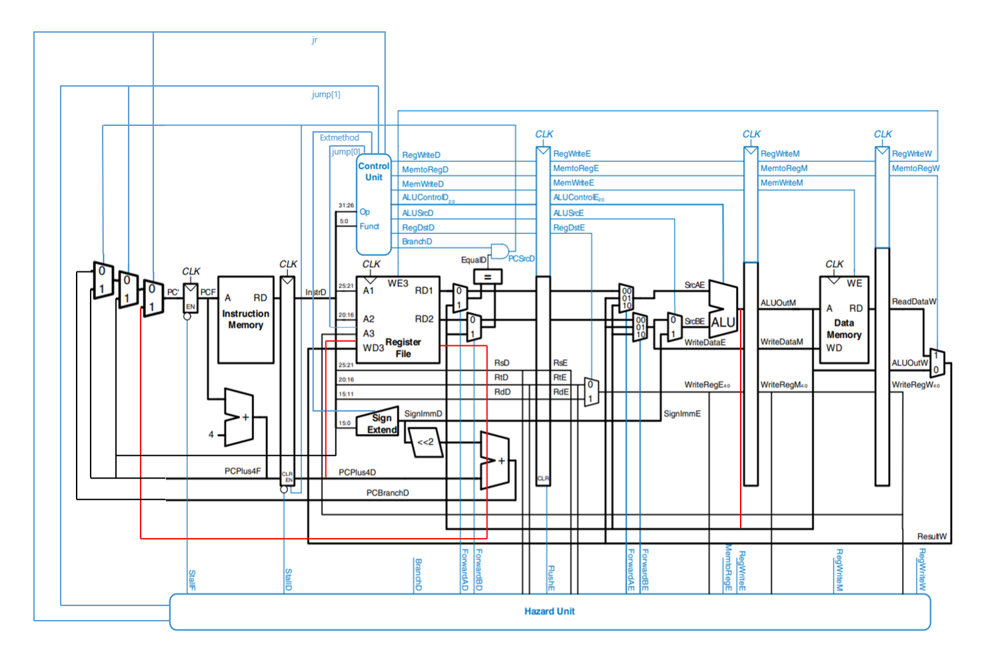
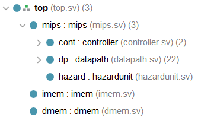

# MIPS-Pipeline 实验报告

贾子安 18307130017

## 1. 整体结构

---------------------------

如图所示，其中：
- **红色**线为增加的数据通路
- **蓝色**线为增加的控制信号
- 一些线虽然教材给出的结构示意图上没有，但是沿用自单周期设计

<div align=center></div>

---------------------------

- **模块结构**：

<div align=center></div>

- 因此`cpu_tb.sv`中判断**指令数+1**的语句应改为：

```verilog
if (~mips.dp.flushD & ~mips.hazard.stallD)
  instr_count = instr_count + 1;
```

## 2. 部件分析

---------------------------

>只介绍相对单周期有改动或者新增的部件

## 2.1. Hazard Unit

---------------------------

该部件用于处理执行命令时遇到的数据冒险和控制冒险

### 2.1.1. 数据冒险

- 产生原因：后续指令所需的数据还没有来得及在前驱操作中获得
- 解决方法：
  - 转发技术，将后续指令所需的数据一经计算出直接转发到所需位置
    - 当前指令处于`Memory`或者`Writeback`阶段，而处在`Execute`阶段的指令需要当前指令的结果：

    ```verilog
    assign forwardAE=(((rsE!=0)&(rsE==writeregM)&regwriteM))?2'b10:((((rsE!=0)&(rsE==writeregW)&regwriteW))?2'b01:2'b00);
    assign forwardBE=(((rtE!=0)&(rtE==writeregM)&regwriteM))?2'b10:((((rtE!=0)&(rtE==writeregW)&regwriteW))?2'b01:2'b00);
    ```

    - 当前指令处于`Memory`阶段，而处在`Decode`阶段的指令需要当前指令的结果:

    >符合该条件的指令只有bne和beq

    ```verilog
    assign forwardAD = (rsD != 0 & rsD == writeregM & regwriteM);
    assign forwardBD = (rtD != 0 & rtD == writeregM & regwriteM);
    ```
    
  - 加入阻塞，一些指令的数据要等到`Memory`阶段结束后才能读出，并到`Writeback`阶段才返回寄存器，此时就需要将该指令后续指令全部暂停一周期执行

    >只有lw指令满足该条件

    - 当前指令处于`Execute`阶段并且是lw指令，且后一条指令需要lw的结果时需要加入阻塞
    - 在`Execute`阶段前的流水线寄存器中插入**气泡**(flush)，并阻止`Fetch`与`Decode`阶段前流水线寄存器的更新(stall)

    ```verilog
    assign lwstall=memtoregE & ((rsD==rtE) | (rtD==rtE));
    ```

### 2.1.2. 控制冒险

- 产生原因：当跳转指令在`Execute`阶段被执行时，此时已经进入`Fetch`与`Decode`阶段的指令必须不造成任何实质性影响
- 解决方法：
  - 在`Decode`与`Execute`阶段前的流水线寄存器插入气泡，并保证跳转目标指令在下一周期进入`Fetch`阶段
  - 将判断是否跳转提前至`Decode`阶段，在`Decode`阶段设计一个专用部件，直接比较两个操作数来得出是否跳转，但同时引入了上文所述的第二种数据冒险。
  - 此时引入新的阻塞条件并相应插入气泡刷掉错误执行的指令：

    ```verilog
    assign branchstall= br & (((writeregE == rsD) | (writeregE == rtD)) | (memtoregM & ((writeregM==rsD)|(writeregM==rtD))));
    assign flushD=(pcsrc|jr|jump)&(~branchstall)&~lwstall);
    ```
  
  - **~lwstall**非常重要，虽然不加也能通过全部测试但是实际上是错误的。
  
### 2.1.3. 改进

- **benchtest**中存在大量branch指令，这些指令在`Decode`阶段普遍需要`Execute`阶段指令的结果，而根据**2.1.2**的解决方案，每次都需要暂停一个周期，存在大量浪费
- 将这种情况下的转发从`Memory`阶段开始变为直接从`Execute`阶段转发，并取消这种情况下的暂停

```verilog
assign branchstall= br & ((memtoregM & ((writeregM==rsD)|(writeregM==rtD))));
assign forwardAD=(rsD!=0)&(rsD==writeregE)&regwriteE;
assign forwardBD=(rtD!=0)&(rtD==writeregE)&regwriteE;
```

- 改变后CPI从1.76下降到了1.44
>个人认为这种改进不是很妥当，因为这样以来(如果各元件都有延迟的话)这个周期会变得很长，进而导致流水线每个周期的时长都相应需要调整，导致适得其反的效果。

## 2.2. 流水线寄存器

---------------------------

- 直接采用整块寄存器，一个阶段对应一个module
- 保存和更新对应阶段的控制信号和数据
- `fetch`与`Decode`阶段前的流水线寄存器能够设置是否更新数据
- `fetch`、`Decode`与`Execute`阶段前的流水线寄存器具有清零功能(气泡)
- 示例：`Decode`阶段流水线寄存器：

  ```verilog
  module prd(
    input logic clk,en,clr,
    input logic [31:0]instr,
    input logic [31:0]pcplus4,
    output logic [31:0]instrD,
    output logic [31:0]pcplus4D
    );
    initial 
        begin
            instrD<=0;
            pcplus4D<=0;
        end
    always @(posedge clk)
        if(clr)
            begin   
                instrD <= 0;
                pcplus4D<=0;
            end
        else if(en)
            begin
                instrD <= instr;
                pcplus4D<=pcplus4;
            end
    endmodule
  ```

## 3. 参考资料

---------------------------

David Money Harris, Sarah L. Harris, Digital Design and Computer Architecture

<a href="https://github.com/SunflowerAries/ICS-Spring20-Fudan/">ICS-Spring20-Fudan</a>


